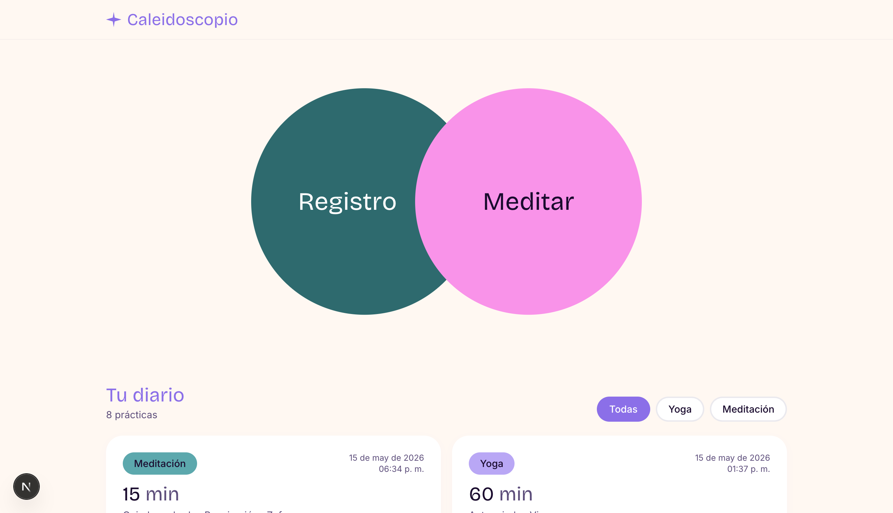
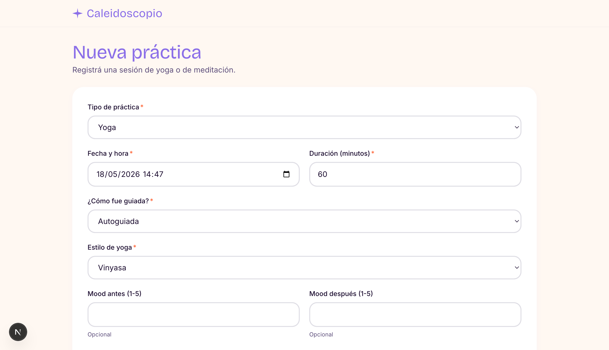
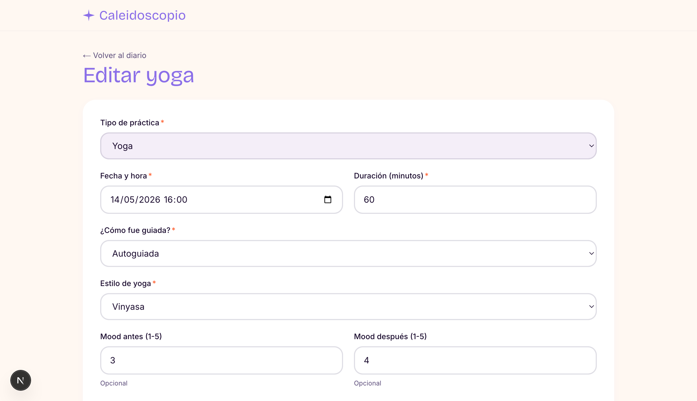
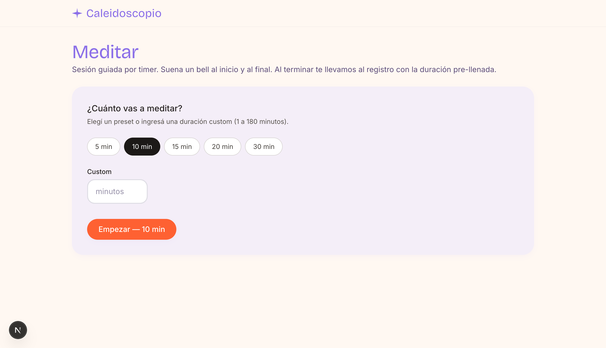

# Caleidoscopio

Personal diary for yoga and meditation practices. Personal project, May 2026.

**Live**: [caleidoscopio-yoga.vercel.app](https://caleidoscopio-yoga.vercel.app)

## Screenshots

**Home — diary and quick actions**



**New practice form**



**Practice detail and edit**



**Meditation timer**



## Stack

- **Next.js 16** (App Router) + strict **TypeScript**
- **Tailwind CSS** for styling
- **Prisma** + **Postgres** (Neon for dev and prod)
- **Zod** for validation with discriminated unions
- **Vitest** (unit) + **Playwright** (E2E)
- **ESLint** + **Prettier**
- **GitHub Actions** for CI

## Setup

Requires Node 24+ and a Postgres database. The fastest path is a free [Neon](https://neon.tech) project.

```bash
git clone <repo>
cd caleidoscopio
npm install
cp .env.example .env
# edit .env: set DATABASE_URL (pooled) and DIRECT_URL (direct) from your Neon dashboard
npx prisma migrate dev      # applies migrations to your database
npm run dev
```

Open [http://localhost:3000](http://localhost:3000).

## Scripts

| Command                | What it does                                |
| ---------------------- | ------------------------------------------- |
| `npm run dev`          | Start the dev server                        |
| `npm run build`        | Production build                            |
| `npm run lint`         | ESLint                                      |
| `npm run typecheck`    | `tsc --noEmit`                              |
| `npm run format`       | Format with Prettier                        |
| `npm test`             | Unit tests (Vitest, watch mode)             |
| `npm test -- --run`    | Unit tests in CI mode                       |
| `npm run test:e2e`     | E2E tests (Playwright, starts the dev server) |
| `npm run db:migrate`   | Create/apply Prisma migrations              |
| `npm run db:studio`    | Open Prisma Studio                          |

## Domain model

A single `Practice` entity with a `type` field ('yoga' \| 'meditation') and optional columns depending on the type. Validation via `z.discriminatedUnion` in `src/lib/schemas.ts`.

**Shared fields**: `date`, `durationMin`, `guidance` (live / recorded / self-guided), `moodBefore`, `moodAfter`, `notes`.

**Yoga-specific**: `yogaStyle` (vinyasa, hatha, ashtanga, yin, restorative, other).

**Meditation-specific**: `focusObject` (breath, mantra, body_scan, sound, visualization, other), `position` (bed, chair, zafu, floor, cushion, other).

## Technical decisions

- **Unified model** instead of separate entities: simplifies the diary listing (one query, one table, one base UI) and future stats queries.
- **Postgres via Neon** for both local dev and production: serverless, free tier, supports database branching per environment. Connection string is portable to any Postgres host.
- **Strict TypeScript** with `noUncheckedIndexedAccess` as a visible quality signal.
- **PR workflow** even as a solo project: each feature on its own branch, PR against `main`, CI runs everything, squash-merge.
- **Hero pivot — from SVG kaleidoscope to two overlapping circles**: typed Bézier path iteration on the original dihedral SVG plateaued before reaching the desired hand-drawn feel, and the WebGL reference that inspired it was out of scope for the MVP. The replacement (`HeroButtons`) is two flat circles with `z-index` overlap and explicit `aria-label`s that contain the visible text (WCAG 2.5.3 *Label in Name*). Less expressive but predictable and shippable.
- **Design system gated to development**: the `/design` route renders palette, typography, components and hero color combinations, but calls `notFound()` when `NODE_ENV !== "development"`. Keeps the internal reference page out of production without losing it as a tool for future iteration.

## Roadmap

See open issues on GitHub for upcoming iterations (stats, asana catalog, Claude API integration, PWA, auth, etc.).
